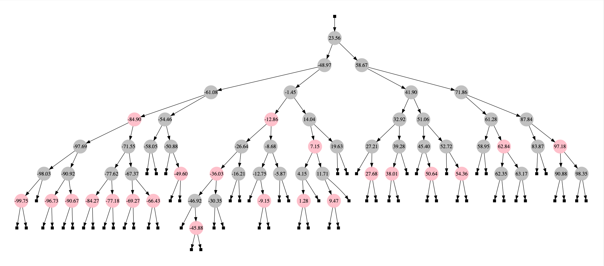

# CLRS Red-Black-Tree Algorithm in Python

<a href="sample.png"> </a>

A python implementation of the Red-black-tree algorithm by Cormen, Leiserson, Rivest, and Stein [CLRS]

I find the description by [CLRS] the most accurate, concise, and easiest to understand.
The only two changes I made are the extra checks for NIL parameter in the beginning of LEFT_ and RIGHT_ROTATE().

# Dependencies

* **Graphviz** for drawing trees. Comment out import if you don't need to draw.

# Usage
See Chap. 13 & 14 in [CLRS]

* **Create a Tree** ```t = rbtree.RedBlackTree()```

* **Create a Node** ```n = rbtree.RedBlackNode(0.0)```

* **Insert a node to a tree** ```t.RB_INSERT(n)```

* **Remove a node from a tree** ```t.RB_DELETE(n)```

* **Root node** n = ```n = t.ROOT()```

* **Minimum node** n = ```n = t.TREE_MINIMUM()```

* **Maximum node** n = ```n =  t.TREE_MAXIMUM()```

* **Iterate ascending**

```python
for v in t:
    print(v)
```
or
```python
n = t.TREE_MINIMUM(t.ROOT())
while not n is t.NIL():
    n = t.TREE_SUCCESSOR(n)
    print(n)
```

* **Iterate descending**

```python
n = t.TREE_MAXIMUM(t.ROOT())
while not n is t.NIL():
    n = t.TREE_PREDECESSOR(n)
    print(n)
```

* **draw tree** ```t.draw('filename_wo_ext', True, 'pdf', 'vertical' )```

See [unit_tests_rbtree.py](unit_tests_rbtree.py) for sample usage.


# References

* [CLRS] Introduction to Algorithms 3rd Ed. Cormen, Thomas H. and Leiserson, Charles E. and Rivest, Ronald L. and Stein, Clifford, The MIT Press, 2001

